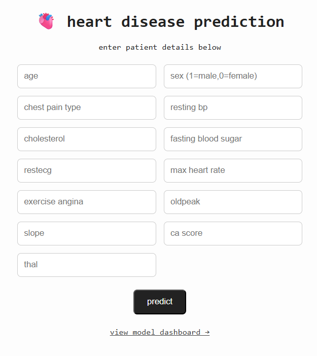

# ❤ Heart Disease Prediction Web App

## Project Overview
This project predicts the risk of heart disease for a patient based on clinical features using machine learning. The main objective is to build an end-to-end ML pipeline that includes data preprocessing, model training, evaluation, and deployment as a flask web app.  

The app provides:  
- Real-time predictions for new patient data  
- Probability scores for risk assessment  
- An interactive dashboard showing model performance metrics  

The goal is to demonstrate the complete workflow from raw healthcare data to a deployable predictive solution.

## Tech Stack

### Data & Machine Learning
- *Python* – core language for ML & web  
- *pandas / numpy* – data manipulation & numerical computations  
- *scikit-learn* – machine learning algorithms & pipeline  
- *tensorflow / keras* – neural network model (optional)  
- *joblib* – save and load trained models  
- *matplotlib / seaborn* – plotting and visualizations  

### Web Development
- *Flask* – backend framework  
- *HTML / CSS / Bootstrap* – frontend & styling  
- *Jinja2 Templates* – dynamic rendering of predictions and dashboards

## How to Use

1. **Clone the repository**
   ```
   git clone <repo-url>
   cd heart-disease-prediction-app
   ```
2. **Install dependencies**
   ```
   pip install -r requirements.txt
   ```
3. **Run the Flask app**
   ```
   python app.py
   ```
4. **Access the web app**
Open your browser and go to `http://127.0.0.1:5000/`
5. **Input patient data**
Fill in the clinical features and click Predict to get the heart disease risk and probability score.
6. **View dashboard**
Navigate to the dashboard page to see results.  

## Results & Conclusions

- The model predicts heart disease risk with high accuracy using patient clinical data.
- Probability scores help quantify the risk for better clinical decision-making.
- The interactive dashboard allows users to analyze model performance and understand prediction trends.
- Deploying as a web app demonstrates the complete pipeline from data preprocessing to real-time predictions.

This project can serve as a foundation for building more advanced healthcare predictive systems, integrating additional features, or using ensemble / deep learning models for improved accuracy.

## Screenshots


